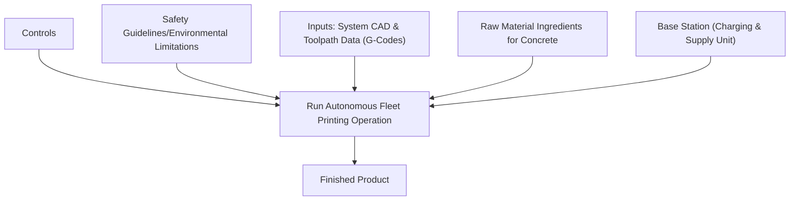
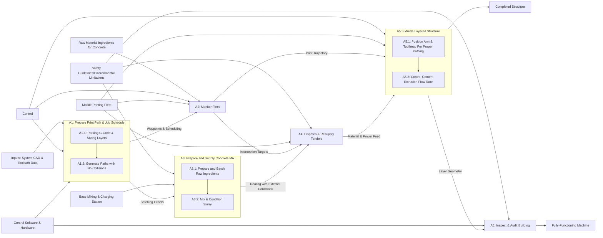

# MMET-491-IDEF0

### A-0 Context Diagram

```mermaid
flowchart TD
    A0["Run Autonomous Fleet Printing Operation"]

    C1["Controls"] --> A0
    C2["Safety Guidelines/Environmental Limitations"] --> A0

    I1["Inputs: System CAD & Toolpath Data (G-Codes)"] --> A0
    I2["Raw Material Ingredients for Concrete"] --> A0

    M1["Base Station (Charging & Supply Unit)"] --> A0

    A0 --> O1["Finished Product"]
```

---

### A0 Decomposition Diagram (6 Activity Blocks)

```mermaid
flowchart LR
    I1["Inputs: System CAD & Toolpath Data"]
    I2["Raw Material Ingredients for Concrete"]

    C1["Control"]
    C2["Safety Guidelines/Environmental Limitations"]

    M1["Mobile Printing Fleet"]
    M2["Base Mixing & Charging Station"]
    M3["Control Software & Hardware"]

    O1["Completed Structure"]
    O2["Fully-Functioning Machine"]

    subgraph A1["A1: Prepare Print Path & Job Schedule"]
        direction TB
        A1_1["A1.1: Parsing G-Code & Slicing Layers"]
        A1_2["A1.2: Generate Paths with No Collisions"]
        A1_1 --> A1_2
    end

    A2["A2: Monitor Fleet"]

    subgraph A3["A3: Prepare and Supply Concrete Mix"]
        direction TB
        A3_1["A3.1: Prepare and Batch Raw Ingredients"]
        A3_2["A3.2: Mix & Condition Slurry"]
        A3_1 --> A3_2
    end

    A4["A4: Dispatch & Resupply Tenders"]
    
    subgraph A5["A5: Extrude Layered Structure"]
        direction TB
        A5_1["A5.1: Position Arm & Toolhead For Proper Pathing"]
        A5_2["A5.2: Control Cement Extrusion Flow Rate"]
        A5_1 --> A5_2
    end

    A6["A6: Inspect & Audit Building"]

    I1 --> A1
    I2 --> A2

    C1 --> A1
    C1 --> A2
    C2 --> A3
    C2 --> A4
    C1 --> A5
    C2 --> A6

    M1 --> A5
    M1 --> A2
    M1 --> A4
    M2 --> A3
    M3 --> A1
    M3 --> A6

    A1 -->|Waypoints & Scheduling| A2
    A1 -->|Batching Orders| A3
    A2 -->|Interception Targets| A4
    A2 -->|Print Trajectory| A5
    A3 -->|Dealing with External Conditions| A4
    A4 -->|Material & Power Feed| A5
    A5 -->|Layer Geometry| A6

    A5 --> O1
    A6 --> O2
```
